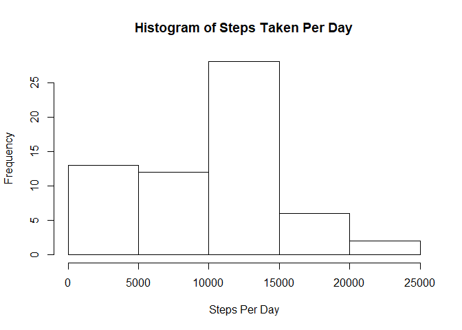
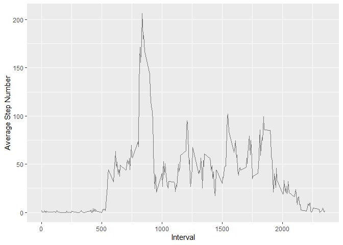
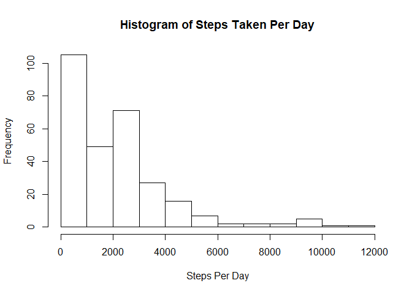
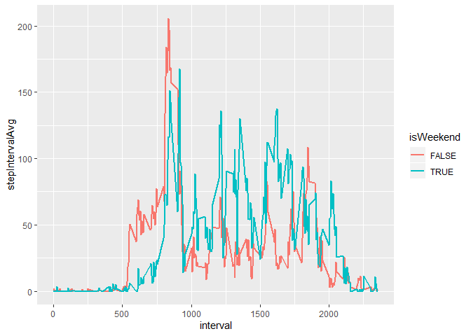

```r
knitr::opts_chunk$set(echo = TRUE)
library(tidyverse)
```

```
## -- Attaching packages -------------------------------------------- tidyverse 1.3.0 --
```

```
## v ggplot2 3.2.1     v purrr   0.3.2
## v tibble  2.1.3     v dplyr   0.8.3
## v tidyr   1.0.0     v stringr 1.4.0
## v readr   1.3.1     v forcats 0.4.0
```

```
## -- Conflicts ----------------------------------------------- tidyverse_conflicts() --
## x dplyr::filter() masks stats::filter()
## x dplyr::lag()    masks stats::lag()
```

## Loading and preprocessing the data

We first start by downloading the data:


```r
download.file("https://d396qusza40orc.cloudfront.net/repdata%2Fdata%2Factivity.zip", destfile = "activity.zip")
unzip("activity.zip")
```

Then we read it in:


```r
activity <- read_csv("activity.csv")
```

```
## Parsed with column specification:
## cols(
##   steps = col_double(),
##   date = col_date(format = ""),
##   interval = col_double()
## )
```

```r
activity
```

```
## # A tibble: 17,568 x 3
##    steps date       interval
##    <dbl> <date>        <dbl>
##  1    NA 2012-10-01        0
##  2    NA 2012-10-01        5
##  3    NA 2012-10-01       10
##  4    NA 2012-10-01       15
##  5    NA 2012-10-01       20
##  6    NA 2012-10-01       25
##  7    NA 2012-10-01       30
##  8    NA 2012-10-01       35
##  9    NA 2012-10-01       40
## 10    NA 2012-10-01       45
## # ... with 17,558 more rows
```


## What is mean total number of steps taken per day?

We can summarize the data per day to find the total number of steps taken each day.
Since there were NA values, it's wise to remove them before taking a sum.

```r
activityStepSum <- activity %>%
        dplyr::group_by(date) %>%
        dplyr::summarize(stepSum = sum(steps, na.rm = T))
activityStepSum
```

```
## # A tibble: 61 x 2
##    date       stepSum
##    <date>       <dbl>
##  1 2012-10-01       0
##  2 2012-10-02     126
##  3 2012-10-03   11352
##  4 2012-10-04   12116
##  5 2012-10-05   13294
##  6 2012-10-06   15420
##  7 2012-10-07   11015
##  8 2012-10-08       0
##  9 2012-10-09   12811
## 10 2012-10-10    9900
## # ... with 51 more rows
```
We can also represent these data as a histogram:

```r
hist(activityStepSum$stepSum, xlab = "Steps Per Day", main = "Histogram of Steps Taken Per Day")
```

<!-- -->

We can also take the summary of these data to find the mean and median of the distribution:

```r
summary(activityStepSum$stepSum)
```

```
##    Min. 1st Qu.  Median    Mean 3rd Qu.    Max. 
##       0    6778   10395    9354   12811   21194
```


## What is the average daily activity pattern?

We may also be interested in the average step frequency of an individual over
the course of a day. We can visualize this by looking at a steps-per-interval graph,
where an interval is 5 minutes and we average the steps across all days. First, we 
find the average number of steps per each interval:

```r
intSummary <- activity %>%
        dplyr::group_by(interval) %>%
        dplyr::summarize(stepIntervalAvg = mean(steps, na.rm = T), stepIntervalMed = median(steps, na.rm = T))
intSummary
```

```
## # A tibble: 288 x 3
##    interval stepIntervalAvg stepIntervalMed
##       <dbl>           <dbl>           <dbl>
##  1        0          1.72                 0
##  2        5          0.340                0
##  3       10          0.132                0
##  4       15          0.151                0
##  5       20          0.0755               0
##  6       25          2.09                 0
##  7       30          0.528                0
##  8       35          0.868                0
##  9       40          0                    0
## 10       45          1.47                 0
## # ... with 278 more rows
```
We can then plot average steps against time:

```r
ggplot(intSummary, aes(x = interval, y = stepIntervalAvg)) + geom_line(alpha = 0.5) + ylab("Average Step Number") + xlab("Interval")
```

<!-- -->

It looks like somewhere around 800-900 has the maximum number of steps on average. 
Lets find out what interval it is exactly:

```r
intSummary[which.max(intSummary$stepIntervalAvg),]
```

```
## # A tibble: 1 x 3
##   interval stepIntervalAvg stepIntervalMed
##      <dbl>           <dbl>           <dbl>
## 1      835            206.              19
```


## Imputing missing values

Earlier I had mentioned that there were some NA values. How many are there exactly?
This can be found quite rapidly with the summary function!

```r
summary(activity$steps)
```

```
##    Min. 1st Qu.  Median    Mean 3rd Qu.    Max.    NA's 
##    0.00    0.00    0.00   37.38   12.00  806.00    2304
```

Since there are so many NAs, it may be worthwile to fill in those values with a reasonable guess.
I'll use the median value for that interval as a surrogate value, since the median tends to 
be a bit more robust (to outliers) than the mean.

```r
activityNaFill <- activity %>%
        dplyr::group_by(interval) %>%
        dplyr::mutate(steps = case_when(is.na(steps) ~ median(steps, na.rm = T), !is.na(steps) ~ steps)) %>%
        dplyr::summarize(stepSum = sum(steps), stepMed = median(steps))
activityNaFill
```

```
## # A tibble: 288 x 3
##    interval stepSum stepMed
##       <dbl>   <dbl>   <dbl>
##  1        0      91       0
##  2        5      18       0
##  3       10       7       0
##  4       15       8       0
##  5       20       4       0
##  6       25     111       0
##  7       30      28       0
##  8       35      46       0
##  9       40       0       0
## 10       45      78       0
## # ... with 278 more rows
```
Let's look at the histogram with these imputed values.


```r
hist(activityNaFill$stepSum, xlab = "Steps Per Day", main = "Histogram of Steps Taken Per Day")
```

<!-- -->

To get a median and mean, let's look at a summary:

```r
summary(activityNaFill$stepSum)
```

```
##    Min. 1st Qu.  Median    Mean 3rd Qu.    Max. 
##     0.0   131.8  1808.0  2013.0  2841.0 11079.0
```
It looks as though imputing the median values has significantly lowered both the median and mean!
Let's take a look at the total steps per day with these filled in values in place:

```r
activityNaFillStepSum <- activity %>%
        dplyr::group_by(interval) %>%
        dplyr::mutate(steps = case_when(is.na(steps) ~ median(steps, na.rm = T), !is.na(steps) ~ steps)) %>%
        dplyr::ungroup() %>%
        dplyr::group_by(date) %>%
        dplyr::summarize(stepSum = sum(steps))
activityNaFillStepSum
```

```
## # A tibble: 61 x 2
##    date       stepSum
##    <date>       <dbl>
##  1 2012-10-01    1141
##  2 2012-10-02     126
##  3 2012-10-03   11352
##  4 2012-10-04   12116
##  5 2012-10-05   13294
##  6 2012-10-06   15420
##  7 2012-10-07   11015
##  8 2012-10-08    1141
##  9 2012-10-09   12811
## 10 2012-10-10    9900
## # ... with 51 more rows
```
As we might expect, adding these new values in either raised the stepSum or had no effect, in the case that all imputed values were 0.


## Are there differences in activity patterns between weekdays and weekends?

It may be interesting to see if activity patterns are different between weekends and weekdays.

```r
activityNaFillWeekend <- activity %>%
        dplyr::mutate(isWeekend = case_when(weekdays(date) %in% c("Saturday", "Sunday") ~ T , !(weekdays(date) %in% c("Saturday", "Sunday")) ~ F)) %>%
        dplyr::group_by(interval, isWeekend) %>%
        dplyr::mutate(steps = case_when(is.na(steps) ~ median(steps, na.rm = T), !is.na(steps) ~ steps)) %>%
        dplyr::summarize(stepIntervalAvg = mean(steps, na.rm = T), stepIntervalMed = median(steps, na.rm = T))
activityNaFillWeekend  
```

```
## # A tibble: 576 x 4
## # Groups:   interval [288]
##    interval isWeekend stepIntervalAvg stepIntervalMed
##       <dbl> <lgl>               <dbl>           <dbl>
##  1        0 FALSE              2.02                 0
##  2        0 TRUE               0                    0
##  3        5 FALSE              0.4                  0
##  4        5 TRUE               0                    0
##  5       10 FALSE              0.156                0
##  6       10 TRUE               0                    0
##  7       15 FALSE              0.178                0
##  8       15 TRUE               0                    0
##  9       20 FALSE              0.0889               0
## 10       20 TRUE               0                    0
## # ... with 566 more rows
```


```r
ggplot(activityNaFillWeekend, aes(x = interval, y = stepIntervalAvg, col = isWeekend)) + geom_line(size = 1)
```

<!-- -->

Plotting these data, it looks like people wake up later on the weekends and tend to be more active during working hours. They may also stay up a bit later too!
